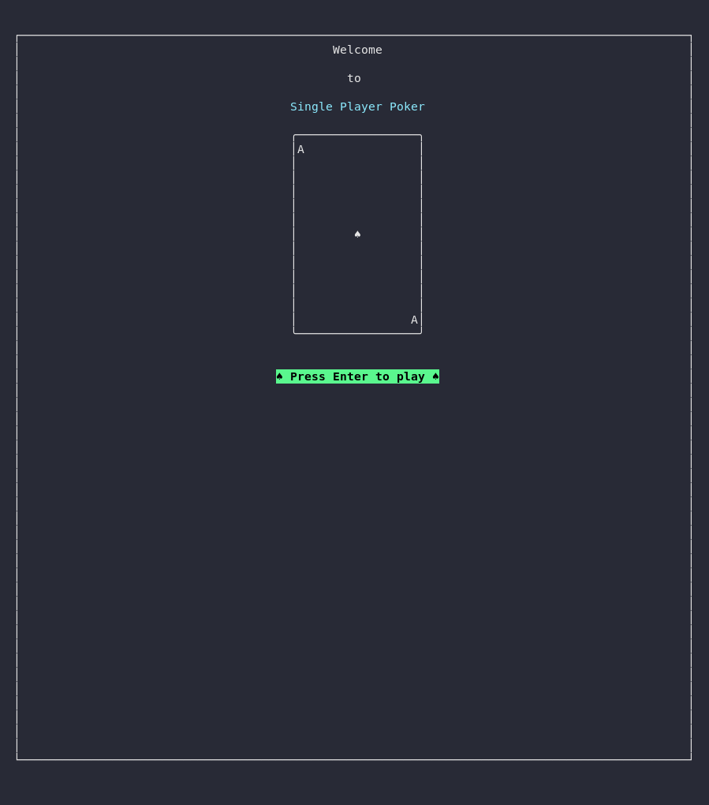
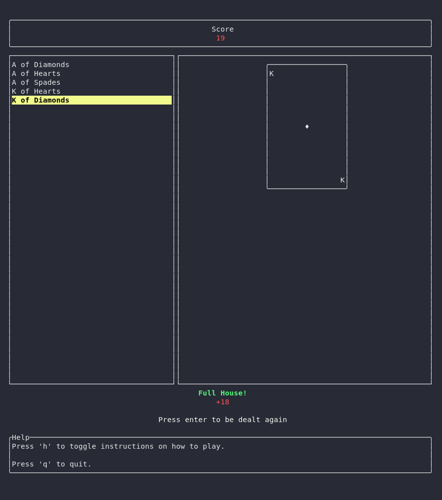

# Single Player Poker

## Specifications
To be able to run the program you need:
- rustc: version 1.58.0 minimum
- cargo: version 1.58.0 minimum

## How to run
Clone the repo
`git clone https://github.com/Laelaps9/Single-Player-Poker.git`

Enter the cloned directory
`cd single-player-poker`

Run the game
`cargo run`

## How to play
In this simplified version of poker the player is dealt 5 cards. The player can select up to 3 cards to change.  
After choosing which cards to change (if any), the game deals the player a new card for each one selected and determines if the player got a winning hand. Points are added to the player's overall score depending on which combination they got.  
5 new cards are dealt.
